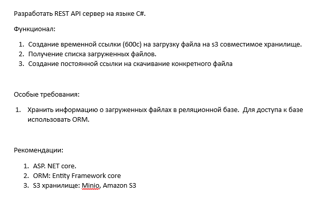

    <h1 align="center">S3ApiTestTask</h1>

    Web API для тестового задания на ASP.NET 6, работающий с S3

  
  
  
    
  
  
  

# Table Of Contents

- [Table Of Contents](#table-of-contents)
- [ТЗ](#тз)
- [Общее описание](#общее-описание)
- [Реализация](#реализация)
    - [Ссылка на загрузку](#ссылка-на-загрузку)
    - [Скачивание файла](#скачивание-файла)
    - [TODO](#todo)
- [Локальный запуск](#локальный-запуск)

# ТЗ

# Общее описание
Реализован API на ASP.NET 6  

Реализована поддержка docker-compose [(см. "Локальный запуск")](#локальный-запуск)  

В качестве s3 совместимого хранилища используется `MinIO`  
API задокументирован с помощью `Swagger`  
Проект структурирован по принципам `clean architecture`  
Используется `CQRS` через [`MediatR`](https://github.com/jbogard/MediatR)  
В качестве ORM используется `Entity Framework Core`, в качестве СУБД `PostgreSql`  
  

# Реализация
### Ссылка на загрузку  
- При запросе ссылки на загрузку файла генерируется presigned URL и создается file в БД  
  
### Скачивание файла
- Скачивание происходит по постоянной ссылке `/AppFile/Download/{file_id}`  
- Если файл был загружен в s3, то генерируется presigned Url для скачивание файла, на которую редиректится клиент
- Если файл не был загружен в s3, то выкидывается ошибка
- Если файл не был загружен в s3 и время жизни ссылки на загрузку закончилось, файл удаляется из БД

### TODO
- асинхронное создание файла в БД при срабатывание event на загрузку файла в MinIO

# Локальный запуск
- `git clone https://github.com/Skye7012/S3ApiTestTask.git`

- `cd S3ApiTestTask`

- `docker-compose build`

- `docker-compose up`

- **Swagger**: [http://localhost:5000/swagger/index.html](http://localhost:5000/swagger/index.html)

- **MinIO**: [http://localhost:9003/login](http://localhost:9003/login)
  
 
  
Volumes для БД будет создан на уровень выше корневой директории

